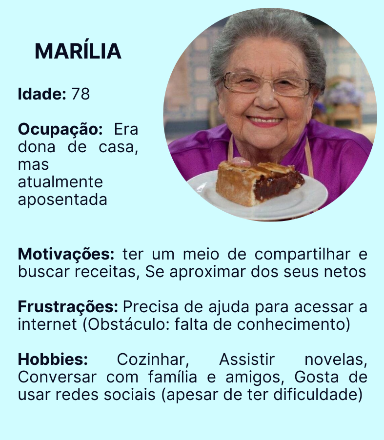
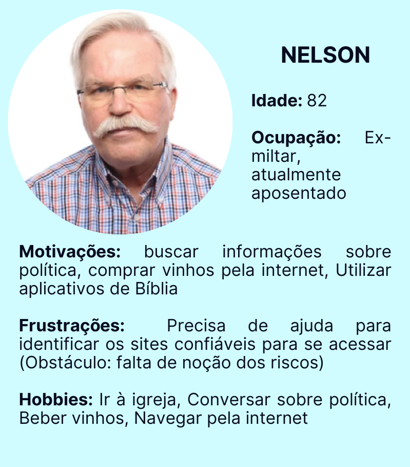
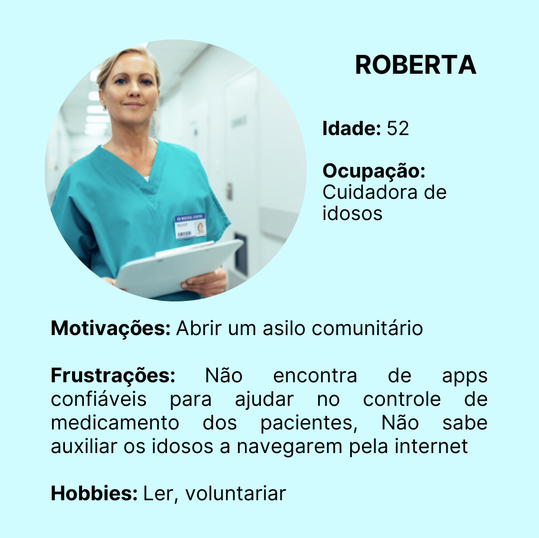
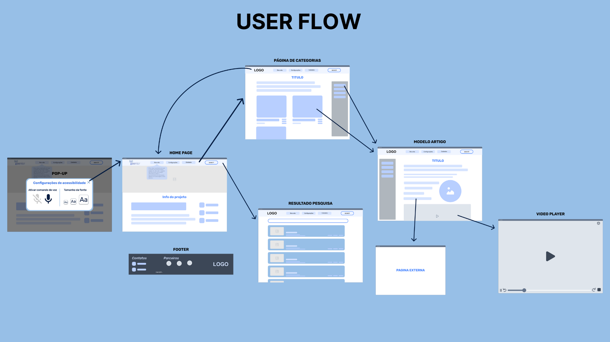
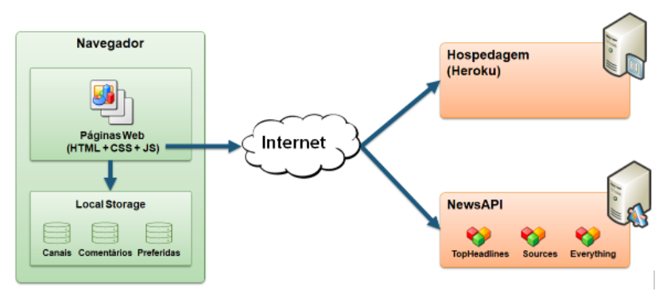

<h1 align="center" id="landing-page">iSenior</h1>

A cada dia que se passa, a utilização da internet tem se tornado mais necessária. Situações do dia a dia, como buscar informações, fazer compras ou se comunicar com os amigos e com a família são, nessa nova realidade, realizadas digitalmente. Entretanto, as pessoas com mais de 65 anos, as quais não foram acostumadas a utilizar os meios digitais com esses intuitos, sentem dificuldade ao serem imersas nesse contexto.
Diante disso, torna-se fundamental que existam ferramentas que auxiliem a terceira idade, de forma a ensinar esse grupo a lidar com os meios digitais tão usados na atualidade.

<h2>Participantes</h2>

<ul>
  <li>Artur Ricardo Martins Drummond Azevedo</li>
  <li>Ana Beatriz Pessoa Braz</li>
  <li>Brenno Augusto Herculano dos Santos</li>
  <li>Eduardo Oliveira Coelho</li>
  <li>Beatriz Fulgencio da Cunha Menezes</li>
  <li>Gabriel Ribeiro Todt Ferreira</li>
</ul>

# Estrutura do Documento

- [Informações do Projeto](#informações-do-projeto)
  - [Participantes](#participantes)
- [Estrutura do Documento](#estrutura-do-documento)
- [Introdução](#introdução)
  - [Problema](#problema)
  - [Objetivos](#objetivos)
  - [Justificativa](#justificativa)
  - [Público-Alvo](#público-alvo)
- [Especificações do Projeto](#especificações-do-projeto)
  - [Personas](#personas-e-mapas-de-empatia)
  - [Histórias de Usuários](#histórias-de-usuários)
  - [Requisitos](#requisitos)
    - [Requisitos Funcionais](#requisitos-funcionais)
    - [Requisitos não Funcionais](#requisitos-não-funcionais)
  - [Restrições](#restrições)
- [Metodologia](#metodologia)
  - [Divisão de Papéis](#divisão-de-papéis)
  - [Ferramentas](#ferramentas)
  - [Controle de Versão](#controle-de-versão)
- [Projeto de Interface](#projeto-de-interface)
  - [User Flow](#user-flow)
  - [Wireframes](#wireframes)
- [**############## SPRINT 1 ACABA AQUI #############**](#-sprint-1-acaba-aqui-)
- [Projeto da Solução](#projeto-da-solução)
  - [Tecnologias Utilizadas](#tecnologias-utilizadas)
  - [Arquitetura da solução](#arquitetura-da-solução)
- [Avaliação da Aplicação](#avaliação-da-aplicação)
  - [Plano de Testes](#plano-de-testes)
  - [Ferramentas de Testes (Opcional)](#ferramentas-de-testes-opcional)
  - [Registros de Testes](#registros-de-testes)
- [Referências](#referências)

# Introdução

## Problema

> O problema que se busca resolver com este projeto é a dificuldade que grande
>  parte dos idosos sente em acessar a internet com segurança e sabendo utilizar seus recursos e facilidades.
>

## Objetivos

> O objetivo geral deste trabalho é a criação de um site informativo que sirva como um guia 
> para que os idosos possam, com mais facilidade, navegar pela internet.
> 
> Como objetivos específicos, podemos ressaltar:
> 
> - Fornecer funcionalidades que permitam maior acessibilidade dentro e fora do site.
> - Ensinar essas pessoas a identificar golpes e fake news.
> - Facilitar a execução de tarefas do dia a dia de idosos por meio da internet.
> 

## Justificativa

> Diferentemente das novas gerações que já nasceram com os recursos tecnológicos 
> contidos no cotidiano, pessoas que nasceram em uma época na qual o acesso à tecnologia 
> era mais restrito, antes da popularização da internet, encontram, hoje, dificuldades para se
> adaptar a uma nova realidade tão digital. Esse novo cenário impõe aos mais velhos a
> necessidade de se conectar à internet para contactar amigos e família, para trabalhar ou 
> para acessar os artigos.
>

## Público-Alvo

> O foco deste trabalho está nos idosos que sentem dificuldade em viver em um cenário tão tecnológico e digital. Sendo assim, o público alvo pode ser definido como a terceira idade, configurada por pessoas com mais de 65 anos, que buscam aprender a utilizar a internet e suas principais ferramentas de acessibilidade para facilitar as tarefas do dia a dia. Além disso, os cuidadores e as famílias têm papel fundamental no projeto, visto que poderão auxiliar o grupo em foco no primeiro contato com  a plataforma. 
 
# Especificações do Projeto

> Foi feita uma pesquisa com idosos e cuidadores, a qual tinha como objetivo identificar os principais aspectos que motivam e que desmotivam os primeiros a utilizarem a internet e as dificuldades dos segundos de solucionar essa dificuldade. A partir dos resultados obtidos, foram elaboradas três personas, duas delas representando idosos e uma representando o cuidador.

## Personas e Mapas de Empatia

> As personas levantadas durante o processo de entendimento do problema são apresentadas nas figuras que se seguem.
> 
> **Exemplo de Persona**
> 
> 
> 
> 

## Histórias de Usuários

> A partir da compreensão do dia a dia das personas identificadas para o projeto, foram registradas as seguintes histórias de usuários.

|EU COMO... `PERSONA`| QUERO/PRECISO ... `FUNCIONALIDADE` |PARA ... `MOTIVO/VALOR`                 |
|--------------------|------------------------------------|----------------------------------------|
|Marília  | saber utilizar com segurança as redes sociais           | manter contato com pessoas próximas               |
|Marília       | acessar blogs de culinária                 | aprender e compartilhar novas receitas |
|Marília       | saber fazer compras online                 | adquirir mais utensílios de cozinha e fazer compras de supermercado pelo celular |
|Nelson       | saber baixar aplicativos                 | acessar a Bíblia pelo celular |
|Nelson       | saber fazer compras online                  | preencher sua adega com vinhos de diversos tipos |
|Nelson       | saber utilizar com segurança as redes sociais                  | conhecer pessoas com as mesmas visões políticas que as suas |
|Roberta       | encontrar aplicativos de confiança                  | ajudá-la a controlar o horário dos remédios de cada paciente e a controlar suas obrigações |
|Roberta       | encontrar canais no Youtube sobre como realizar tarefas básicas digitalmente                  | auxiliar a ensinar para os idosos como navegar pela internet |
## Requisitos

> O escopo funcional do projeto é definido por meio dos requisitos funcionais que descrevem as possibilidades de interação dos usuários, bem como os requisitos não funcionais que descrevem os aspectos que o sistema deverá apresentar de maneira geral. Estes requisitos são apresentados a seguir.
> 
### Requisitos Funcionais
> A tabela a seguir apresenta os requisitos do projeto, identificando a prioridade em que os mesmos devem ser entregues.

|ID    | Descrição do Requisito  | Prioridade |
|------|-----------------------------------------|----|
|RF-01| Cadastro de artigos | BAIXA | 
|RF-02| Exibição de artigos  | BAIXA |
|RF-03| Cadastro do FAQ  | BAIXA |
|RF-04| Exibição do FAQ  | BAIXA |
|RF-05| Cadastro do usuário  | BAIXA |
|RF-06| Login  | MÉDIA |
|RF-07| Exibição do perfil  | BAIXA |
|RF-08| Página de pesquisa  | MÉDIA |
|RF-09| Favoritar artigos  | MÉDIA |
|RF-010| Exibição de artigos aleatórios  | BAIXA |
|RF-011| Página de Categoria  | BAIXA |

### Requisitos não Funcionais

> A tabela a seguir apresenta os requisitos não funcionais que o projeto deverá atender.

|ID     | Descrição do Requisito  |Prioridade |
|-------|-------------------------|----|
|RNF-01| Template | ALTA | 

## Restrições

> As questões que limitam a execução desse projeto e que se configuram como obrigações claras para o desenvolvimento do projeto em questão são apresentadas na tabela a seguir.

|ID| Restrição                                             |
|--|-------------------------------------------------------|
|01| O site deve ser desenvolvido com as habilidades adquiridas no primeiro semestre do curso |
|02| O trabalho tem a data de entrega até o final do semestre        |

# Metodologia

> A metodologia do processo se baseia na organização do grupo e nas ferramentas utilizadas para a realização do trabalho.

## Divisão de Papéis

| Aluno  | Função              |
|-----------|-------------------------|
| Ana Beatriz Braz  | Design & Organiza funções e horários |
| Artur Ricardo Martins Drummond Azevedo  | Front-End | 
| Beatriz Fulgencio da Cunha Menezes | Design & Organiza funções e horários |
| Brenno Augusto Herculano dos Santos | Cria novas features e ajuda no front-end |
| Eduardo Oliveira Coelho | Front-End |
| Gabriel Ribeiro Todt Ferreira | Front-End |

>
> **Links Úteis**:
> - [11 Passos Essenciais para Implantar Scrum no seu Projeto](https://mindmaster.com.br/scrum-11-passos/)
> - [Scrum em 9 minutos](https://www.youtube.com/watch?v=XfvQWnRgxG0)

## Ferramentas

| Ambiente  | Plataforma              |Link de Acesso |
|-----------|-------------------------|---------------|
|Documentos do projeto  | Google Docs |  https://docs.google.com/document/d/1qgYBMHY91sYjbmvIANGuxynerLZylI9V24V_Agck1uE/edit?pli=1# | 
|Repositório de código fonte | GitHub | https://github.com/ICEI-PUC-Minas-PPLCC-TI/tiaw-ppl-cc-m-20221-t3-g7 | 
|Gerenciamento do Projeto | Trello |  https://trello.com/invite/b/y2NQIEZo/2b4fe119c04ffdc0287878d040b8b62a/sprint-1 | 
|Projeto de Interface e  Wireframes | Figma | https://www.figma.com/file/lQZHCFeZFqmCXMISXtrOEJ/Untitled?node-id=0%3A1  | 
|Design Thinking | Miro | https://miro.com/app/board/uXjVOBuUuE4=/  |

# Projeto de Interface

> Foi desenvolvido um projeto de interface que facilita a acessibilidade dos idosos e dos cuidadores, com ferramentas e design de uso simples. O projeto tem uma identidade visual padronizada em todas as telas que são projetadas para funcionamento em desktops e dispositivos móveis.

## User Flow

> O diagrama apresentado na Figura 2 mostra o fluxo de interação do usuário (user flow) pelas telas do sistema. Cada uma das telas deste fluxo é detalhada na seção de Wireframes que se segue.
>  
> 

## Wireframes

> Conforme fluxo de telas do projeto, apresentado no item anterior, as telas do sistema são apresentadas em detalhes nos itens que se seguem. As telas do sistema apresentam uma estrutura comum que é apresentada na Figura 3. Nesta estrutura, existem 3 grandes blocos, descritos a seguir. São eles:

> 
> 
> 

# **############## SPRINT 1 ACABA AQUI #############**

# Projeto da Solução

......  COLOQUE AQUI O SEU TEXTO ......

## Tecnologias Utilizadas

......  COLOQUE AQUI O SEU TEXTO ......

> Descreva aqui qual(is) tecnologias você vai usar para resolver o seu
> problema, ou seja, implementar a sua solução. Liste todas as
> tecnologias envolvidas, linguagens a serem utilizadas, serviços web,
> frameworks, bibliotecas, IDEs de desenvolvimento, e ferramentas.
> Apresente também uma figura explicando como as tecnologias estão
> relacionadas ou como uma interação do usuário com o sistema vai ser
> conduzida, por onde ela passa até retornar uma resposta ao usuário.
> 
> Inclua os diagramas de User Flow, esboços criados pelo grupo
> (stoyboards), além dos protótipos de telas (wireframes). Descreva cada
> item textualmente comentando e complementando o que está apresentado
> nas imagens.

## Arquitetura da solução

......  COLOQUE AQUI O SEU TEXTO E O DIAGRAMA DE ARQUITETURA .......

> Inclua um diagrama da solução e descreva os módulos e as tecnologias
> que fazem parte da solução. Discorra sobre o diagrama.
> 
> **Exemplo do diagrama de Arquitetura**:
> 
> 

# Avaliação da Aplicação

......  COLOQUE AQUI O SEU TEXTO ......

> Apresente os cenários de testes utilizados na realização dos testes da
> sua aplicação. Escolha cenários de testes que demonstrem os requisitos
> sendo satisfeitos.

## Plano de Testes

......  COLOQUE AQUI O SEU TEXTO ......

> Enumere quais cenários de testes foram selecionados para teste. Neste
> tópico o grupo deve detalhar quais funcionalidades avaliadas, o grupo
> de usuários que foi escolhido para participar do teste e as
> ferramentas utilizadas.
> 
> **Links Úteis**:
> - [IBM - Criação e Geração de Planos de Teste](https://www.ibm.com/developerworks/br/local/rational/criacao_geracao_planos_testes_software/index.html)
> - [Práticas e Técnicas de Testes Ágeis](http://assiste.serpro.gov.br/serproagil/Apresenta/slides.pdf)
> -  [Teste de Software: Conceitos e tipos de testes](https://blog.onedaytesting.com.br/teste-de-software/)

## Ferramentas de Testes (Opcional)

......  COLOQUE AQUI O SEU TEXTO ......

> Comente sobre as ferramentas de testes utilizadas.
> 
> **Links Úteis**:
> - [Ferramentas de Test para Java Script](https://geekflare.com/javascript-unit-testing/)
> - [UX Tools](https://uxdesign.cc/ux-user-research-and-user-testing-tools-2d339d379dc7)

## Registros de Testes

......  COLOQUE AQUI O SEU TEXTO ......

> Discorra sobre os resultados do teste. Ressaltando pontos fortes e
> fracos identificados na solução. Comente como o grupo pretende atacar
> esses pontos nas próximas iterações. Apresente as falhas detectadas e
> as melhorias geradas a partir dos resultados obtidos nos testes.

# Referências

......  COLOQUE AQUI O SEU TEXTO ......

> Inclua todas as referências (livros, artigos, sites, etc) utilizados
> no desenvolvimento do trabalho.
> 
> **Links Úteis**:
> - [Formato ABNT](https://www.normastecnicas.com/abnt/trabalhos-academicos/referencias/)
> - [Referências Bibliográficas da ABNT](https://comunidade.rockcontent.com/referencia-bibliografica-abnt/)
